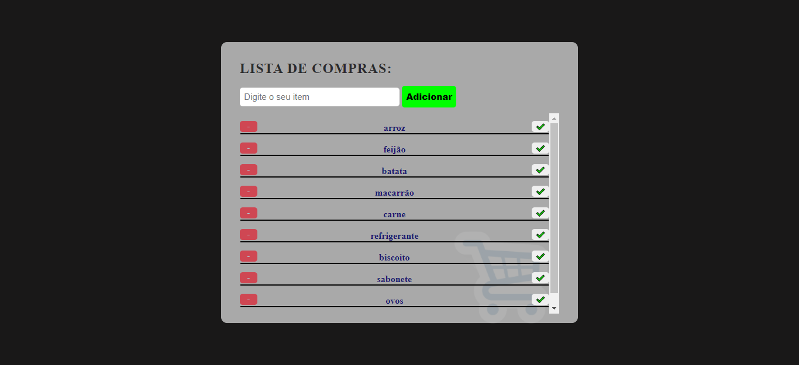

# ListaDeCompras-Kenzie

## Projeto realizado na semana JS da Kenzie Academy.

### Foram utilizadas as tecnologias:

1. HTML
    - Esqueleto da aplicação,separação dos elementos.
2. CSS
    - Estilização dos elementos na tela,cores,posição,animação.
3. JavaSCript (JS)
    - Atualição do conteúdo.
   
### Apliquei essass funcionalidades extras : 
 - Adicionar o item, quando pressionado a tecla ENTER;
 - Dar crítica ( Mensagem e input vermelho), quando tentar adicionar o item e o campo estiver vazio;
 - Tirar a crítica quando o campo estiver preenchido;
 - Marcar item como concluido;
 - Scroll quando chegar a um determinado tamanho;

